# SilentSort General Workflow Overview

## Purpose
High-level overview of SilentSort's file processing pipeline showing the complete user journey from file detection to completion.

## Workflow Diagram

```mermaid
graph TD
    A["File Detected<br/>📁 New File Event"] --> B["Initial Validation<br/>🔍 Check File Type"]
    
    B --> C{File Type<br/>Supported?}
    C -->|No| D["Skip File<br/>❌ Log & Ignore"]
    C -->|Yes| E["Content Extraction<br/>📄 Read File Content"]
    
    E --> F["Content Analysis<br/>🤖 AI Analysis Node"]
    F --> G["Generate Suggestions<br/>💡 Name & Category Node"]
    
    G --> H["Confidence Check<br/>📊 Evaluate Results"]
    H --> I{Confidence Level<br/>Above Threshold?}
    
    I -->|High Confidence<br/>> 85%| J["Auto-Apply Mode<br/>⚡ Direct Processing"]
    I -->|Medium Confidence<br/>50-85%| K["User Approval Mode<br/>👤 Show Suggestions"]
    I -->|Low Confidence<br/>< 50%| L["Manual Review Mode<br/>❓ Request User Input"]
    
    %% Auto-Apply Branch
    J --> M["Execute File Operation<br/>🔄 Rename/Move File"]
    M --> N{Operation<br/>Successful?}
    N -->|Yes| O["Update Database<br/>💾 Log Success"]
    N -->|No| P["Rollback & Log Error<br/>⚠️ Error Handling"]
    
    %% User Approval Branch
    K --> Q["Present to User<br/>🖥️ Show UI Notification"]
    Q --> R{User Decision<br/>Within Timeout?}
    R -->|Approve| S["Execute Approved Action<br/>✅ Apply Suggestion"]
    R -->|Reject| T["Learn from Rejection<br/>📚 Update Model"]
    R -->|Timeout| U["Use Default Action<br/>⏰ Fallback Behavior"]
    
    %% Manual Review Branch
    L --> V["Request User Input<br/>📝 Show Manual Form"]
    V --> W{User Provides<br/>Input?}
    W -->|Yes| X["Process User Input<br/>👨‍💻 Custom Action"]
    W -->|No| Y["Skip Processing<br/>⏭️ Leave Unchanged"]
    
    %% Execution Paths Converge
    S --> M
    T --> Z["Update Learning Model<br/>🧠 Feedback Integration"]
    U --> M
    X --> M
    
    %% Success Paths
    O --> AA["Context Learning<br/>📈 Pattern Recognition"]
    AA --> BB["Update Folder Rules<br/>📋 Rule Refinement"]
    BB --> CC["Workflow Complete<br/>✅ Success State"]
    
    %% Error Handling
    P --> DD["Error Analysis<br/>🔍 Diagnose Issue"]
    DD --> EE{Error Type<br/>Category?}
    EE -->|Permission Error| FF["Request Permissions<br/>🔐 Security Check"]
    EE -->|File Locked| GG["Queue for Retry<br/>⏳ Delayed Processing"]
    EE -->|AI Service Error| HH["Fallback to Basic Rules<br/>🔧 Simple Naming"]
    EE -->|Critical Error| II["Alert User<br/>🚨 Manual Intervention"]
    
    %% Retry Logic
    FF --> JJ{Permissions<br/>Granted?}
    JJ -->|Yes| M
    JJ -->|No| II
    
    GG --> KK["Wait & Retry<br/>⏱️ Exponential Backoff"]
    KK --> LL{Retry Count<br/>< Max Attempts?}
    LL -->|Yes| E
    LL -->|No| II
    
    HH --> MM["Basic File Naming<br/>📝 Fallback Rules"]
    MM --> M
    
    %% Learning Integration
    Z --> NN["Analyze User Patterns<br/>📊 Behavior Analysis"]
    NN --> OO["Update AI Model<br/>🤖 Personalization"]
    OO --> PP["Improve Future Predictions<br/>🎯 Enhanced Accuracy"]
    
    %% End States
    CC --> QQ["Monitor for New Files<br/>👀 Continue Watching"]
    II --> RR["Log Critical Error<br/>📋 Error Database"]
    Y --> SS["File Remains Unchanged<br/>📁 Original State"]
    
    %% Continuous Loop
    QQ --> A
    
    %% Styling
    classDef startNode fill:#e1f5fe
    classDef aiNode fill:#f3e5f5
    classDef userNode fill:#fff3e0
    classDef successNode fill:#e8f5e8
    classDef errorNode fill:#ffebee
    classDef decisionNode fill:#fff9c4
    
    class A startNode
    class F,G,AA,NN,OO aiNode
    class K,Q,V userNode
    class CC,O,S successNode
    class P,DD,II,RR errorNode
    class C,I,N,R,W,EE,JJ,LL decisionNode
```

## Key Decision Points

1. **Confidence-Based Routing**: Files are processed differently based on AI confidence
2. **User Interaction**: Medium confidence files require user approval
3. **Error Recovery**: Comprehensive error handling with retry logic
4. **Learning Loop**: System improves from user feedback

## Next Steps

See `06_langgraph-workflow-architecture.md` for detailed LangGraph implementation of this workflow. 