# LangGraph Workflow Architecture for SilentSort

## Purpose
Technical implementation of SilentSort's AI-powered file organization using LangGraph's agent orchestration, state management, and human-in-the-loop patterns.

## LangGraph Workflow Diagram

```mermaid
graph TD
    %% LangGraph State Initialization
    START["🚀 START<br/>Initialize AgentState<br/>{file_path, content, metadata}"] --> LOAD_STATE["📋 Load State<br/>AgentState with:<br/>• file_path<br/>• raw_content<br/>• processing_context"]
    
    %% Content Analysis Chain
    LOAD_STATE --> CONTENT_EXTRACTOR["🔧 Content Extractor Tool<br/>Tool: extract_file_content()<br/>• PDF text extraction<br/>• Image OCR<br/>• Document parsing"]
    
    CONTENT_EXTRACTOR --> CONTENT_ANALYZER["🤖 Content Analysis Agent<br/>LLM: gpt-4-turbo<br/>Prompt: analyze_file_content<br/>Output: ContentAnalysis"]
    
    CONTENT_ANALYZER --> PARALLEL_PROCESSING{"⚡ Parallel Node Processing<br/>Fork AgentState to:"}
    
    %% Parallel Processing Branches
    PARALLEL_PROCESSING --> NAME_AGENT["📝 Naming Agent<br/>LLM: gpt-4-turbo<br/>Tools: [generate_names]<br/>Context: content + folder_rules"]
    PARALLEL_PROCESSING --> CATEGORY_AGENT["📂 Category Agent<br/>LLM: gpt-3.5-turbo<br/>Tools: [classify_content]<br/>Context: existing_folders"]
    PARALLEL_PROCESSING --> CONFIDENCE_AGENT["📊 Confidence Agent<br/>LLM: gpt-3.5-turbo<br/>Tools: [calculate_confidence]<br/>Input: analysis_results"]
    
    %% Parallel Results Aggregation
    NAME_AGENT --> AGGREGATOR["🔄 State Aggregator<br/>Combine parallel results:<br/>• suggested_names[]<br/>• categories[]<br/>• confidence_scores"]
    CATEGORY_AGENT --> AGGREGATOR
    CONFIDENCE_AGENT --> AGGREGATOR
    
    %% Decision Router with Conditional Edges
    AGGREGATOR --> DECISION_ROUTER{"🎯 Decision Router<br/>Conditional Edge:<br/>route_by_confidence()"}
    
    DECISION_ROUTER -->|confidence > 0.85| AUTO_EXECUTOR["⚡ Auto Executor Agent<br/>Tools: [rename_file, move_file]<br/>Action: Direct execution"]
    DECISION_ROUTER -->|0.5 < confidence < 0.85| HUMAN_APPROVAL["👤 Human-in-the-Loop<br/>Interrupt: wait_for_approval<br/>UI: Show suggestions<br/>Timeout: 30s"]
    DECISION_ROUTER -->|confidence < 0.5| MANUAL_REVIEW["❓ Manual Review Agent<br/>Tools: [request_user_input]<br/>Action: Show form UI"]
    
    %% Human-in-the-Loop Handling
    HUMAN_APPROVAL --> APPROVAL_ROUTER{"🤔 User Response Router<br/>Conditional Edge:<br/>route_by_user_action()"}
    
    APPROVAL_ROUTER -->|approved| EXECUTOR["✅ File Operation Executor<br/>Tools: [safe_file_operations]<br/>Rollback capability"]
    APPROVAL_ROUTER -->|rejected| FEEDBACK_AGENT["📚 Feedback Learning Agent<br/>Tools: [update_user_preferences]<br/>Action: Store rejection pattern"]
    APPROVAL_ROUTER -->|timeout| TIMEOUT_HANDLER["⏰ Timeout Handler<br/>Default action based on<br/>user_preferences.timeout_behavior"]
    
    %% Manual Review Flow
    MANUAL_REVIEW --> MANUAL_ROUTER{"📝 Manual Input Router<br/>Conditional Edge:<br/>has_user_input()"}
    MANUAL_ROUTER -->|input_provided| CUSTOM_EXECUTOR["👨‍💻 Custom Action Executor<br/>Tools: [execute_custom_action]<br/>Input: user_provided_name"]
    MANUAL_ROUTER -->|no_input| SKIP_NODE["⏭️ Skip Processing<br/>State: file_unchanged<br/>Log: user_skipped"]
    
    %% Execution Paths Converge
    AUTO_EXECUTOR --> EXECUTION_VALIDATOR["🔍 Execution Validator<br/>Tools: [verify_operation]<br/>Check: file_exists, permissions"]
    EXECUTOR --> EXECUTION_VALIDATOR
    CUSTOM_EXECUTOR --> EXECUTION_VALIDATOR
    TIMEOUT_HANDLER --> EXECUTION_VALIDATOR
    
    %% Validation and Error Handling
    EXECUTION_VALIDATOR --> VALIDATION_ROUTER{"✅ Validation Router<br/>Conditional Edge:<br/>operation_successful()"}
    
    VALIDATION_ROUTER -->|success| SUCCESS_LOGGER["📊 Success Logger Agent<br/>Tools: [log_success, update_stats]<br/>Context: operation_metadata"]
    VALIDATION_ROUTER -->|failure| ERROR_HANDLER["⚠️ Error Handler Agent<br/>Tools: [rollback, log_error]<br/>Strategy: exponential_backoff"]
    
    %% Learning and Context Updates
    SUCCESS_LOGGER --> CONTEXT_UPDATER["🧠 Context Learning Agent<br/>Tools: [update_folder_context]<br/>Action: Learn patterns"]
    FEEDBACK_AGENT --> PREFERENCE_UPDATER["⚙️ Preference Updater<br/>Tools: [update_user_model]<br/>ML: Pattern recognition"]
    
    %% Memory and State Persistence
    CONTEXT_UPDATER --> MEMORY_WRITER["💾 Memory Writer<br/>Tools: [save_to_vectorstore]<br/>Store: file_processing_history"]
    PREFERENCE_UPDATER --> MEMORY_WRITER
    
    %% Error Recovery Workflows
    ERROR_HANDLER --> ERROR_CLASSIFIER{"🔍 Error Classification<br/>Conditional Edge:<br/>classify_error_type()"}
    
    ERROR_CLASSIFIER -->|permission_error| PERMISSION_AGENT["🔐 Permission Handler<br/>Tools: [request_permissions]<br/>macOS: Security framework"]
    ERROR_CLASSIFIER -->|file_locked| RETRY_SCHEDULER["⏳ Retry Scheduler<br/>Tools: [schedule_retry]<br/>Strategy: exponential_backoff"]
    ERROR_CLASSIFIER -->|ai_service_error| FALLBACK_AGENT["🔧 Fallback Agent<br/>Tools: [basic_file_naming]<br/>Rules: deterministic_patterns"]
    ERROR_CLASSIFIER -->|critical_error| ALERT_AGENT["🚨 Alert Agent<br/>Tools: [notify_user]<br/>UI: System notification"]
    
    %% Retry Logic Chain
    RETRY_SCHEDULER --> RETRY_COUNTER["🔢 Retry Counter<br/>State: retry_count++<br/>Max: 3 attempts"]
    RETRY_COUNTER --> RETRY_ROUTER{"🔄 Retry Decision<br/>Conditional Edge:<br/>can_retry()"}
    RETRY_ROUTER -->|can_retry| CONTENT_EXTRACTOR
    RETRY_ROUTER -->|max_retries| ALERT_AGENT
    
    %% Permission Handling
    PERMISSION_AGENT --> PERMISSION_ROUTER{"🔐 Permission Check<br/>Conditional Edge:<br/>permissions_granted()"}
    PERMISSION_ROUTER -->|granted| EXECUTION_VALIDATOR
    PERMISSION_ROUTER -->|denied| ALERT_AGENT
    
    %% Fallback Execution
    FALLBACK_AGENT --> BASIC_EXECUTOR["📝 Basic File Naming<br/>Tools: [apply_basic_rules]<br/>Pattern: timestamp_based"]
    BASIC_EXECUTOR --> EXECUTION_VALIDATOR
    
    %% Final States and Monitoring
    MEMORY_WRITER --> MONITORING_AGENT["📈 Monitoring Agent<br/>Tools: [update_metrics]<br/>Track: success_rate, performance"]
    ALERT_AGENT --> ERROR_LOGGER["📋 Error Logger<br/>Tools: [log_critical_error]<br/>Store: error_database"]
    SKIP_NODE --> SKIP_LOGGER["📝 Skip Logger<br/>Tools: [log_skipped_file]<br/>Reason: user_choice"]
    
    %% Workflow Completion
    MONITORING_AGENT --> END_SUCCESS["✅ END - Success<br/>AgentState: {<br/>  status: 'completed',<br/>  new_file_path: string,<br/>  operation_log: object<br/>}"]
    ERROR_LOGGER --> END_ERROR["❌ END - Error<br/>AgentState: {<br/>  status: 'failed',<br/>  error: string,<br/>  retry_scheduled: boolean<br/>}"]
    SKIP_LOGGER --> END_SKIP["⏭️ END - Skipped<br/>AgentState: {<br/>  status: 'skipped',<br/>  reason: 'user_choice'<br/>}"]
    
    %% Continuous Learning Loop
    END_SUCCESS --> PATTERN_ANALYZER["🎯 Pattern Analysis Agent<br/>Tools: [analyze_success_patterns]<br/>ML: Improve future predictions"]
    PATTERN_ANALYZER --> MODEL_UPDATER["🤖 Model Update Agent<br/>Tools: [fine_tune_prompts]<br/>Action: Personalize AI behavior"]
    
    %% LangGraph State Flow Styling
    classDef startNode fill:#e3f2fd,stroke:#1976d2,stroke-width:3px
    classDef agentNode fill:#f3e5f5,stroke:#7b1fa2,stroke-width:2px
    classDef toolNode fill:#fff3e0,stroke:#f57c00,stroke-width:2px
    classDef routerNode fill:#fff9c4,stroke:#f9a825,stroke-width:2px
    classDef successNode fill:#e8f5e8,stroke:#388e3c,stroke-width:2px
    classDef errorNode fill:#ffebee,stroke:#d32f2f,stroke-width:2px
    classDef endNode fill:#fce4ec,stroke:#c2185b,stroke-width:3px
    classDef parallelNode fill:#e0f2f1,stroke:#00796b,stroke-width:3px
    
    class START,LOAD_STATE startNode
    class CONTENT_ANALYZER,NAME_AGENT,CATEGORY_AGENT,CONFIDENCE_AGENT,FEEDBACK_AGENT,CONTEXT_UPDATER,PREFERENCE_UPDATER,PERMISSION_AGENT,FALLBACK_AGENT,ALERT_AGENT,MONITORING_AGENT,PATTERN_ANALYZER,MODEL_UPDATER agentNode
    class CONTENT_EXTRACTOR,AUTO_EXECUTOR,EXECUTOR,CUSTOM_EXECUTOR,SUCCESS_LOGGER,MEMORY_WRITER,RETRY_SCHEDULER,BASIC_EXECUTOR toolNode
    class DECISION_ROUTER,APPROVAL_ROUTER,MANUAL_ROUTER,VALIDATION_ROUTER,ERROR_CLASSIFIER,RETRY_ROUTER,PERMISSION_ROUTER routerNode
    class SUCCESS_LOGGER,END_SUCCESS successNode
    class ERROR_HANDLER,ERROR_LOGGER,END_ERROR errorNode
    class END_SUCCESS,END_ERROR,END_SKIP endNode
    class PARALLEL_PROCESSING,AGGREGATOR parallelNode
```



## LangGraph Core Implementation

### AgentState Definition
```python
from typing import TypedDict, List, Optional, Dict, Any
from langgraph.graph import StateGraph

class FileProcessingState(TypedDict):
    # File Information
    file_path: str
    original_filename: str
    raw_content: str
    file_type: str
    file_size: int
    
    # AI Analysis Results
    content_analysis: Dict[str, Any]
    suggested_names: List[str]
    categories: List[str]
    confidence_scores: Dict[str, float]
    
    # User Interaction
    user_decision: Optional[str]
    user_input: Optional[str]
    approval_timeout: int
    
    # Processing State
    operation_result: Optional[bool]
    new_file_path: Optional[str]
    retry_count: int
    processing_context: Dict[str, Any]
    
    # Error Handling
    last_error: Optional[str]
    error_type: Optional[str]
    rollback_data: Optional[Dict]
    
    # Learning Data
    user_patterns: Dict[str, Any]
    folder_context: Dict[str, Any]
    operation_metadata: Dict[str, Any]
```

### Core Workflow Setup
```python
def create_silentsort_langgraph():
    workflow = StateGraph(FileProcessingState)
    
    # Add nodes
    workflow.add_node("load_state", load_state_node)
    workflow.add_node("content_extractor", content_extractor_tool)
    workflow.add_node("content_analyzer", content_analysis_agent)
    workflow.add_node("parallel_processing", parallel_analysis_node)
    workflow.add_node("decision_router", decision_router_node)
    workflow.add_node("human_approval", human_approval_node)
    workflow.add_node("auto_executor", auto_execution_agent)
    workflow.add_node("execution_validator", validation_agent)
    workflow.add_node("memory_writer", memory_writer_node)
    
    # Entry point
    workflow.set_entry_point("load_state")
    
    # Linear flow
    workflow.add_edge("load_state", "content_extractor")
    workflow.add_edge("content_extractor", "content_analyzer")
    workflow.add_edge("content_analyzer", "parallel_processing")
    workflow.add_edge("parallel_processing", "decision_router")
    
    # Conditional routing
    workflow.add_conditional_edges(
        "decision_router",
        route_by_confidence,
        {
            "auto_executor": "auto_executor",
            "human_approval": "human_approval",
            "manual_review": "manual_review"
        }
    )
    
    # Compile with checkpointer for state persistence
    from langgraph.checkpoint.memory import MemorySaver
    app = workflow.compile(
        checkpointer=MemorySaver(),
        interrupt_before=["human_approval"]
    )
    
    return app
```

### Key LangGraph Patterns Used

#### 1. Parallel Processing Node
```python
from langchain_core.runnables import RunnableParallel

def parallel_analysis_node(state: FileProcessingState):
    parallel_chain = RunnableParallel({
        "naming": naming_agent,
        "categorization": category_agent,
        "confidence": confidence_agent
    })
    
    results = parallel_chain.invoke({
        "content": state["raw_content"],
        "context": state["processing_context"]
    })
    
    return {
        "suggested_names": results["naming"]["names"],
        "categories": results["categorization"]["categories"],
        "confidence_scores": results["confidence"]["scores"]
    }
```

#### 2. Human-in-the-Loop with Interrupt
```python
def human_approval_node(state: FileProcessingState):
    # This node creates an interrupt point
    # Workflow will pause here until resumed
    return {
        "status": "awaiting_user_input",
        "ui_payload": {
            "suggested_name": state["suggested_names"][0],
            "confidence": state["confidence_scores"]["overall"],
            "current_file": state["file_path"]
        }
    }

# Resume workflow after user input
async def resume_with_user_decision(thread_id: str, user_decision: str):
    app = create_silentsort_langgraph()
    config = {"configurable": {"thread_id": thread_id}}
    
    # Resume from interrupt with user decision
    result = await app.ainvoke(
        {"user_decision": user_decision},
        config=config
    )
    return result
```

#### 3. Conditional Edge Routing
```python
def route_by_confidence(state: FileProcessingState) -> str:
    confidence = state["confidence_scores"]["overall"]
    
    if confidence > 0.85:
        return "auto_executor"
    elif confidence > 0.5:
        return "human_approval"
    else:
        return "manual_review"

def route_by_user_action(state: FileProcessingState) -> str:
    decision = state.get("user_decision", "timeout")
    
    if decision == "approved":
        return "executor"
    elif decision == "rejected":
        return "feedback_agent"
    else:
        return "timeout_handler"
```

#### 4. Error Recovery with Retry Logic
```python
def error_recovery_node(state: FileProcessingState):
    error_type = classify_error(state["last_error"])
    retry_count = state.get("retry_count", 0)
    
    if error_type == "permission_error":
        return {"next_action": "request_permissions"}
    elif error_type == "file_locked" and retry_count < 3:
        return {
            "next_action": "schedule_retry",
            "retry_count": retry_count + 1,
            "retry_delay": 2 ** retry_count  # Exponential backoff
        }
    elif error_type == "ai_service_error":
        return {"next_action": "fallback_naming"}
    else:
        return {"next_action": "alert_user"}
```

## Integration with FastAPI Service

```python
from fastapi import FastAPI, BackgroundTasks
import asyncio

app = FastAPI()
langgraph_app = create_silentsort_langgraph()

@app.post("/process-file")
async def process_file_endpoint(file_data: dict):
    thread_id = f"file_{hash(file_data['path'])}"
    config = {"configurable": {"thread_id": thread_id}}
    
    # Start LangGraph workflow
    result = await langgraph_app.ainvoke(
        {
            "file_path": file_data["path"],
            "raw_content": file_data["content"],
            "processing_context": {"source": "file_watcher"}
        },
        config=config
    )
    
    return {
        "status": result.get("status"),
        "suggestions": result.get("suggested_names", []),
        "confidence": result.get("confidence_scores", {}),
        "thread_id": thread_id
    }

@app.post("/user-decision/{thread_id}")
async def handle_user_decision(thread_id: str, decision: dict):
    config = {"configurable": {"thread_id": thread_id}}
    
    # Resume workflow from interrupt
    result = await langgraph_app.ainvoke(
        {"user_decision": decision["action"]},
        config=config
    )
    
    return {"status": "processed", "result": result}
```

## Benefits of LangGraph Architecture

1. **State Persistence**: Workflows can pause/resume across API calls
2. **Human-in-the-Loop**: Built-in interrupts for user interaction
3. **Parallel Processing**: Multiple AI agents work simultaneously
4. **Error Recovery**: Sophisticated retry and fallback mechanisms
5. **Learning Integration**: Continuous improvement from user feedback
6. **Tool Orchestration**: Seamless file system operation integration

## Implementation Priority

1. **Phase 1**: Basic workflow with content analysis and naming agents
2. **Phase 2**: Add human-in-the-loop approval system
3. **Phase 3**: Implement error recovery and retry logic
4. **Phase 4**: Add learning and context improvement features 